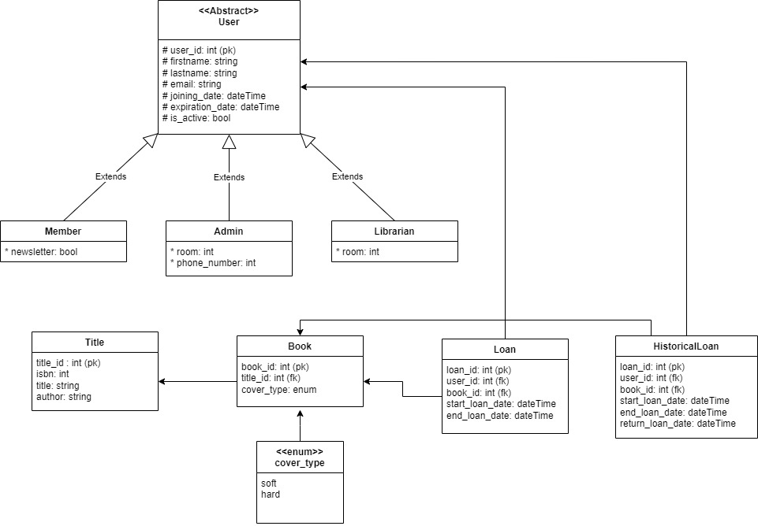

# Dokumentacja

## Wstęp
Aplikacja została stworzona w oparciu o framework Spring Boot 3.2 
Interfejs użytkonika wykonany przy użyciu JavaFX
Do obsługi bazdy danych użyto Hibernate JPA

Aplikacja jest uruchamiana na adresie `localhost:8080`


## Opis funkcjonalności
Aplikacja została sworzona dla czytelni w celu usprawnienia procesu obsługi czytelników.      

Będzie umożliwiała generowanie statystyk oraz raportów.
Dodatkowo będzie możliwość wysyłania powiadomień do czytelników o zbliżającym się terminie oddania książki oraz innych powiadomień.

## Opis modelu


MODEL - docent //todo
Dodatkowo została zaimplementowana pomocnicza klasa `CamelToSnakeStrategy`, która pozwala na automatyczne mapowanie nazw pól w klasach na nazwy kolumn w bazie danych.


## Repozytoria
Do skomunikowania modelu aplikacji z bazą danych użyto interfesjów `Repository` dla każdej klasy korzystającej z bazy danych (np. `UserRepository`, `LoanRepository`)
Wszystkie repozytoria dziedziczą po klasie JpaRepository, która zawiera podstawowe metody do obsługi bazy danych.
Dodatkowo zostały zaimplementowane metody wyszukiwania danych w bazie danych.


## Opis UI
Aplikacja posiada prosty interfejs użytkownika. Aktualnie pozwala on na dodanie użytkownika do bazy (aktualne ustawienie utworzy konto z uprawnieniami zwykłego użytkonika)
Komunikację UI-model zaimplementowano w oparciu o wzorzec MVC (Model-View-Controller). Pozwala on na łatwe rozszerzanie aplikacji o kolejne funkcjonalności.
Zapewnia aktualizację interfejsu w czasie rzeczywistym przy zmianie danych w modelu. 

Klasa `AddUserController` odpowiada za wyświetlenie widoku oraz obsługę formularza tworzenia nowego użytkownika, wywołuje ona widok, który 
znajduje się w pliku `AddUser.fxml` ze stylami w pliku `AddUserStyles.css`


## Podpiecie bazy danych
W pliku `application.properties` zostały zapisane adres oraz poświadczenia do łączenia się z bazą danych. Aktualnie aplikacja łączy się z bazą na serwerze AGH


## Testy
Napisane zostały testy jednostkowe dla walidacji pól formularza tworzącego nowego użytkownika (`UserValidatorTest`).
```