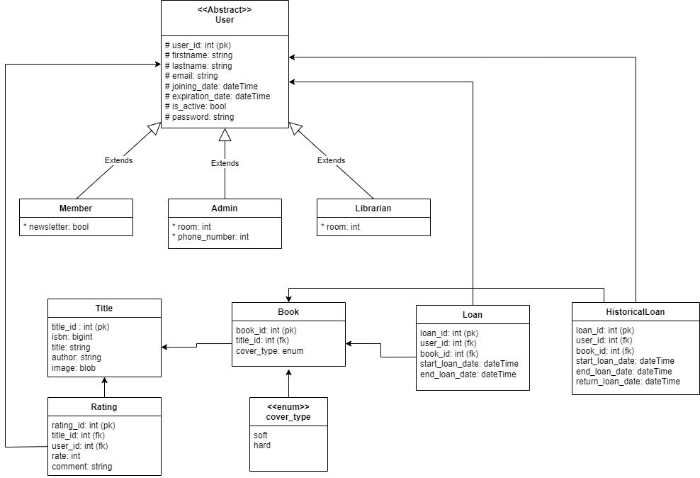

# Dokumentacja

## Wstęp
Aplikacja została stworzona w oparciu o framework Spring Boot 3.2 
Interfejs użytkonika wykonany przy użyciu JavaFX
Do obsługi bazdy danych użyto Hibernate JPA

Aplikacja jest uruchamiana na adresie `localhost:8080`


## Opis funkcjonalności
Aplikacja została sworzona dla czytelni w celu usprawnienia procesu obsługi czytelników.      

Będzie umożliwiała generowanie statystyk oraz raportów.
Dodatkowo będzie możliwość wysyłania powiadomień do czytelników o zbliżającym się terminie oddania książki oraz innych powiadomień.

## Opis modelu



## Model bazy danych składa się z 3 pakietów: books, loans, users.

### Pakiet users
Pakiet ten składa się z abstrakcyjnej klasy `User`, w której mamy podstawowe informacje o każdym użytkowniku
tj. id, firstName, lastName, email, joinDate, expirationDate. Klasy `Admin`, `Librarian`, `Member` dziedziczą po klasie
`User`oraz mają swoje pola specyficzne dla danego typu użytkownika.
* `Member` posiada pole newsletter informujące czy dana osoba chce odszymywać.
* `Libriarian` posiada pole room informujące o numerze pokoju, w którym pracuje.
* `Admin` posiada pola room oraz phoneNumber.

### Pakiet books
Pakiet ten składa się z enumeratora `CoverType` pozwalającego określić czy dany egzemplarz książki jest w twardej
czy w miękkiej oprawie. Klasa `Title` z polami title_id, isbn, title, author, reprezentuje dany tytuł dostępny w bibliotece.
Klasa `Book` posiada pola book_id, coverType, loan, historicalLoans, title. Loan służy do szybkiego znalezienia czytelnika,
który aktualnie wypożyczył daną książkę, historicalLoans zapewnia szybki dostęp do historii wypożyczeń danego egzemplarza książki.

### Pakiet loans
Pakiet ten składa się z klasy `Loan` oraz `HistoricalLoan`. Klasa loan posiada pola loanId, startLoanDate, endLoanDate, member, book, user.
Reprezentuje ona wypożyczenie książki przez użytkownika. 
Klasa `HistoricalLoan` z polami loanId, startLoanDate, endLoanDate, returLoanDate, member, book jest klasą reprezentującą
historię wypożyczeń książek.


## Pakiet strategy
Dodatkowo została zaimplementowana pomocnicza klasa `CamelToSnakeStrategy`, która pozwala na automatyczne mapowanie nazw pól w klasach na nazwy kolumn w bazie danych.


## Pakiet repository
Do skomunikowania modelu aplikacji z bazą danych użyto interfesjów `Repository` dla każdej klasy korzystającej z bazy danych (np. `UserRepository`, `LoanRepository`)
Wszystkie repozytoria dziedziczą po klasie JpaRepository, która zawiera podstawowe metody do obsługi bazy danych.
Dodatkowo zostały zaimplementowane metody wyszukiwania danych w bazie danych.


## Opis UI
Aplikacja posiada prosty interfejs użytkownika. Aktualnie pozwala on na dodanie użytkownika do bazy (aktualne ustawienie utworzy konto z uprawnieniami zwykłego użytkonika)
Komunikację UI-model zaimplementowano w oparciu o wzorzec MVC (Model-View-Controller). Pozwala on na łatwe rozszerzanie aplikacji o kolejne funkcjonalności.
Zapewnia aktualizację interfejsu w czasie rzeczywistym przy zmianie danych w modelu. 

Klasa `AddUserController` odpowiada za wyświetlenie widoku oraz obsługę formularza tworzenia nowego użytkownika, wywołuje ona widok, który 
znajduje się w pliku `AddUser.fxml` ze stylami w pliku `AddUserStyles.css`


## Pakiet validator
W pakiecie validator znajduje się klasa `UserValidator` pozwalająca na walidację danych wprowadzanych przez użytkownika.
Sprawdzane są email, imie i nazwisko.
* email musi zacząć się od ciągu znaków alfanumerycznych po których nastąpi znak '@',
następnie dowolna sekcja nazw domenowych oddzielone kropką, ostatnia sekwencja domeny może składać się tylko z małych i dużych liter
* imie musi zaczynać się z dużej litery i może zawierać tylko litery, długość imienia musi się mieścić w przedziale [2, 30]
* nazwisko musi zaczynać się z dużej litery i może zawierać tylko litery, może to być nazwisko podwójne,
wtedy kolejne człony przedzielone są zankiem pauzy '-,' długość nazwiska musi się mieścić w przedziale [2, 30]


## Podpiecie bazy danych
W pliku `application.properties` zostały zapisane adres oraz poświadczenia do łączenia się z bazą danych. Aktualnie aplikacja łączy się z bazą na serwerze AGH


## Testy
Napisane zostały testy jednostkowe dla walidacji pól formularza tworzącego nowego użytkownika (`UserValidatorTest`).
```